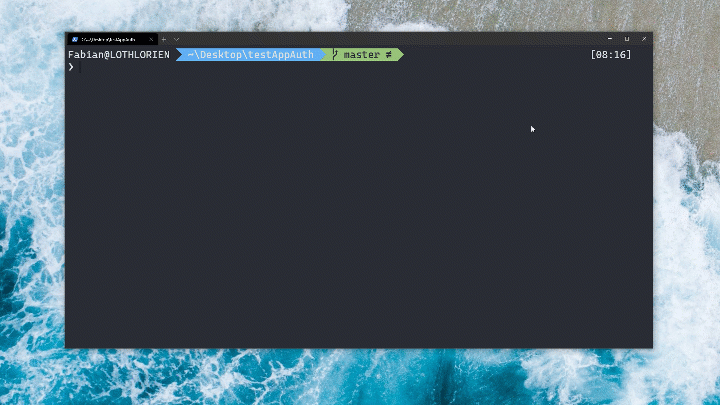

# Angular Lib for OpenID Connect & OAuth2

 [](https://www.npmjs.com/package/angular-auth-oidc-client) [](https://www.npmjs.com/package/angular-auth-oidc-client) [](https://www.npmjs.com/package/angular-auth-oidc-client) [](https://github.com/prettier/prettier) [](https://coveralls.io/github/damienbod/angular-auth-oidc-client?branch=master)

> OpenID Code Flow with PKCE, Code Flow with refresh tokens, OpenID Connect Implicit Flow

## OpenID Certification

This library is <a href="http://openid.net/certification/#RPs">certified</a> by OpenID Foundation. (RP Implicit and Config RP)

<a href="http://openid.net/certification/#RPs"></a>

## Features

- Supports OpenID Connect Code Flow with PKCE
- Supports Code Flow PKCE with Refresh tokens
- Supports Revocation Endpoint
- Support for current best practice
- Implements OIDC validation as specified, complete client side validation for REQUIRED features
- [Supports OpenID Connect Implicit Flow](http://openid.net/specs/openid-connect-implicit-1_0.html)
- [OpenID Connect Session Management 1.0](http://openid.net/specs/openid-connect-session-1_0.html)
- [OAuth 2.0 Pushed authorisation requests (PAR) draft](https://tools.ietf.org/html/draft-ietf-oauth-par-06)
- Samples for most of the common use cases

## Installation

### Ng Add

You can use the schematics and `ng add` the library.

```
ng add angular-auth-oidc-client
```

And answer the questions. A module will be created which encapsulates your configuration.



### Npm / Yarn

Navigate to the level of your `package.json` and type

```typescript
 npm install angular-auth-oidc-client
```

or with yarn

```typescript
 yarn add angular-auth-oidc-client
```

## Documentation

- [Quickstart](https://github.com/damienbod/angular-auth-oidc-client/tree/main/docs/quickstart.md)
- [Samples](https://github.com/damienbod/angular-auth-oidc-client/tree/main/docs/samples.md)

  - [Code Flow with PKCE Using a configuration from an http source and silent renew](https://github.com/damienbod/angular-auth-oidc-client/tree/main/docs/samples.md#code-flow-with-pkce-using-a-configuration-from-an-http-source-and-silent-renew)
  - [Code Flow PKCE with Refresh tokens](https://github.com/damienbod/angular-auth-oidc-client/tree/main/docs/samples.md#code-flow-pkce-with-refresh-tokens)
  - [Code Flow PKCE Auto login](https://github.com/damienbod/angular-auth-oidc-client/tree/main/docs/samples.md#code-flow-pkce-auto-login)
  - [Code Flow with PKCE basic with silent renew](https://github.com/damienbod/angular-auth-oidc-client/tree/main/docs/samples.md#code-flow-with-pkce-basic-with-silent-renew)
  - [Code flow with popup](https://github.com/damienbod/angular-auth-oidc-client/tree/main/docs/samples.md#popup-code-flow-with-pkce)
  - [Code flow with pushed authorization request](https://github.com/damienbod/angular-auth-oidc-client/tree/main/docs/samples.md#code-flow-with-pushed-authorization-request)
  - [Azure B2C Code Flow PKCE with silent renew](https://github.com/damienbod/angular-auth-oidc-client/tree/main/docs/samples.md#azure-b2c-code-flow-pkce-with-silent-renew)
  - [Azure AD Code Flow PKCE with silent renew](https://github.com/damienbod/angular-auth-oidc-client/tree/main/docs/samples.md#azure-ad-oidc-code-flow-with-pkce)
  - [Implicit Flow with silent renew (Not recommended)](https://github.com/damienbod/angular-auth-oidc-client/tree/main/docs/samples.md#implicit-flow-with-silent-renew-not-recommended)
  - [Implicit Flow google (Not recommended)](https://github.com/damienbod/angular-auth-oidc-client/tree/main/docs/samples.md#implicit-flow-google-not-recommended)
  - [Code flow with a lazy loaded module](https://github.com/damienbod/angular-auth-oidc-client/tree/main/docs/samples.md#code-flow-with-a-lazy-loaded-module)

- [Silent renew](https://github.com/damienbod/angular-auth-oidc-client/tree/main/docs/silent-renew.md)

  - [Silent Renew Code Flow with PKCE](https://github.com/damienbod/angular-auth-oidc-client/tree/main/docs/silent-renew.md#silent-renew-code-flow-with-pkce)
  - [Silent Renew Code Flow with PKCE with refresh tokens](https://github.com/damienbod/angular-auth-oidc-client/tree/main/docs/silent-renew.md#silent-renew-code-flow-with-pkce-with-refresh-tokens)
  - [Silent Renew Implicit Flow](https://github.com/damienbod/angular-auth-oidc-client/tree/main/docs/silent-renew.md#silent-renew-implicit-flow)
  - [Secure Token Server CSP and CORS](https://github.com/damienbod/angular-auth-oidc-client/tree/main/docs/silent-renew.md#secure-token-server-csp-and-cors)

- [Guards](https://github.com/damienbod/angular-auth-oidc-client/tree/main/docs/guards.md)
- [Features](https://github.com/damienbod/angular-auth-oidc-client/tree/main/docs/features.md)
  - [Public Events](https://github.com/damienbod/angular-auth-oidc-client/tree/main/docs/features.md#public-events)
  - [Auth with a popup](https://github.com/damienbod/angular-auth-oidc-client/tree/main/docs/authorizing-popup.md)
  - [Custom Storage](https://github.com/damienbod/angular-auth-oidc-client/tree/main/docs/features.md#custom-storage)
  - [Custom parameters](https://github.com/damienbod/angular-auth-oidc-client/tree/main/docs/features.md#custom-parameters)
  - [Using the OIDC package in a module or a Angular lib](https://github.com/damienbod/angular-auth-oidc-client/tree/main/docs/features.md#using-the-oidc-package-in-a-module-or-a-angular-lib)
  - [Delay the loading or pass an existing AuthWellKnownEndpoints config](https://github.com/damienbod/angular-auth-oidc-client/tree/main/docs/features.md#delay-the-loading-or-pass-an-existing-well-knownopenid-configuration-configuration)
- [Logout](https://github.com/damienbod/angular-auth-oidc-client/tree/main/docs/logout.md)
- [Using and revoking the access token](https://github.com/damienbod/angular-auth-oidc-client/tree/main/docs/using-access-tokens.md)
- [CSP & CORS](https://github.com/damienbod/angular-auth-oidc-client/tree/main/docs/csp-cors-config.md)
- [Public API](https://github.com/damienbod/angular-auth-oidc-client/tree/main/docs/public-api.md)
- [Configuration](https://github.com/damienbod/angular-auth-oidc-client/tree/main/docs/configuration.md)
- [Migration](https://github.com/damienbod/angular-auth-oidc-client/tree/main/docs/migration.md)
- [Changelog](https://github.com/damienbod/angular-auth-oidc-client/tree/master/CHANGELOG.md)

## Quickstart

> For the example of the Code Flow. For further examples please check the [Samples](docs/samples.md) Section

> NOTE If you have done the installation with the schematics, these modules and files should be available already!!!

If the schematics did not do this already: Import the module and services in your module.

```typescript
import { HttpClientModule } from '@angular/common/http';
import { APP_INITIALIZER, NgModule } from '@angular/core';
import { AuthModule, LogLevel, OidcConfigService } from 'angular-auth-oidc-client';
// ...

export function configureAuth(oidcConfigService: OidcConfigService) {
  return () =>
    oidcConfigService.withConfig({
      stsServer: '<your sts address here>',
      redirectUrl: window.location.origin,
      postLogoutRedirectUri: window.location.origin,
      clientId: 'angularClient',
      scope: 'openid profile email',
      responseType: 'code',
      silentRenew: true,
      silentRenewUrl: `${window.location.origin}/silent-renew.html`,
      logLevel: LogLevel.Debug,
    });
}

@NgModule({
  // ...
  imports: [
    // ...
    AuthModule.forRoot(),
  ],
  providers: [
    OidcConfigService,
    {
      provide: APP_INITIALIZER,
      useFactory: configureAuth,
      deps: [OidcConfigService],
      multi: true,
    },
  ],
  // ...
})
export class AppModule {}
```

And call the method `checkAuth()` from your `app.component.ts`. The method `checkAuth()` is needed to process the redirect from your sts and set the correct states. This method must be used to ensure the correct functioning of the library.

```typescript
import { Component, OnDestroy, OnInit } from '@angular/core';
import { OidcClientNotification, OidcSecurityService, PublicConfiguration } from 'angular-auth-oidc-client';
import { Observable } from 'rxjs';

@Component({
  /**/
})
export class AppComponent implements OnInit {
  constructor(public oidcSecurityService: OidcSecurityService) {}

  ngOnInit() {
    this.oidcSecurityService.checkAuth().subscribe((auth) => console.log('is authenticated', auth));
  }

  login() {
    this.oidcSecurityService.authorize();
  }

  logout() {
    this.oidcSecurityService.logoff();
  }
}
```

## Using the access token

You can get the access token by calling the method `getToken()` on the `OidcSecurityService`

```typescript
const token = this.oidcSecurityService.getToken();
```

And then you can use it in the HttpHeaders

```typescript
import { HttpHeaders } from '@angular/common/http';

const token = this.oidcSecurityServices.getToken();

const httpOptions = {
  headers: new HttpHeaders({
    Authorization: 'Bearer ' + token,
  }),
};
```

## License

MIT

## Version 10

if you need information about version 10 please search here

https://github.com/damienbod/angular-auth-oidc-client/tree/version-10
